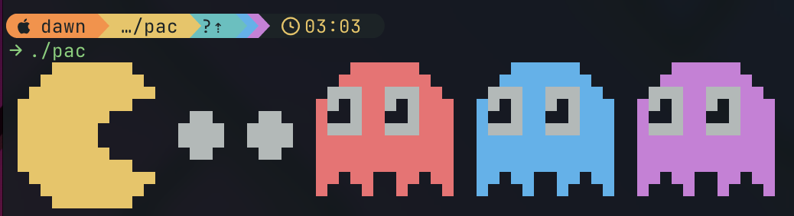
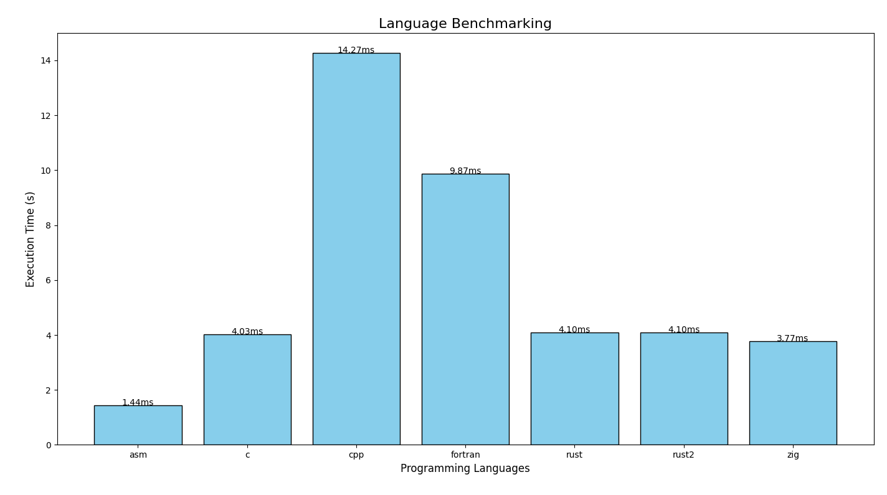

# Pac

Fast pac man art in the terminal

<details>
<summary>Performance</summary>



</details>

<!-- vim-markdown-toc GFM -->

* [Description](#description)
* [Features](#features)
* [Building a version](#building-a-version)
* [Measuring Performance](#measuring-performance)
* [Contributing](#contributing)
    * [Constraints](#constraints)
    * [Adding your version](#adding-your-version)

<!-- vim-markdown-toc -->

## Description

This project generates an ASCII art representation of Pac-Man using different programming languages and compares their performance. The output includes coloured Pac-Man ASCII art and utilizes Unicode characters for the visual effects. You can build and run different versions of the program written in C, C++, Zig, Rust, and Assembly. Additionally, the program allows you to measure the performance of each version by running 1000 iterations and reporting the elapsed time.

## Features

- ASCII art representation of Pac-Man
- Colours and Unicode characters used to enhance the visual output
- Multiple versions/implementations in different languages
- Measures performance across languages and implementations

## Building a version

To get started, clone the repository and navigate to the project director:

```bash
git clone https://github.com/NewDawn0/pac.git
cd pac
```

And then build the default version using the following command:

```bash
nix build .
```

Or to build a specific version, run the command:

```bash
nix build .#<version>
```

To view all available versions/implementations, run the following:

```bash
nix flake show
```

nix build

## Measuring Performance

To get the performance of an implementation, build it and then run the follwing

```bash
./measure.sh measure
```

This will run the version for 1000 iterations and show the elapsed time

## Contributing

Feel free to upload your own version of the Pac-Man script in any language, and make it as fast as possible! To contribute, follow these steps:

### Constraints

- The version must be in a single file and must compile to the pac executable
- The version must support both macOS and Linux
- All the figures objects (eg. Pac-Man, Ghosts, ...) must be stored separately and cannot be initially stored with colour formatting
- You cannot use any libraries or frameworks

### Adding your version

1. Fork the repo
2. Add your implementation in a new language or improve an existing one
3. Add your source in `./src/<language-extension>/pac-<your-impl>` where the file must be just called `pac` if there isn't a preexisting file with that name
4. Add your build to the `./flake.nix` and don't forget to add it to the overlays as well as inherit the output;
5. Create a PR

I welcome contributions and look forward to seeing how fast you can make your version!
